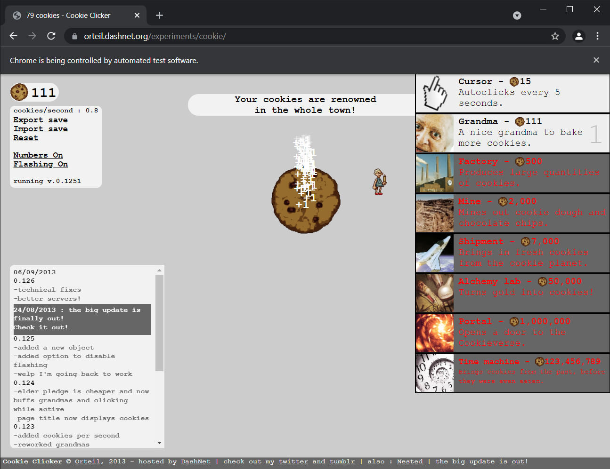

# COOKIE CLICKER BOT

## About
It's a script created to automate the cookie clicker game. 

## Cookie Clicker 
> Cookie Clicker is an incremental game created by French programmer Julien "Orteil" Thiennot in 2013. The user initially clicks on a big cookie on the screen, earning a single cookie per click.
> They can then spend their earned cookies upon purchasing assets such as "cursors" and other "buildings" that automatically produce cookies. 
> Upgrades are also available and can improve the efficiency of clicks and buildings, among many other mechanics that allow the user to earn cookies in different ways.
> Though the game has no ending, it has hundreds of achievements, and users may aim to reach milestone numbers of cookies.           
> <a href ='https://en.wikipedia.org/wiki/Cookie_Clicker'>(Source : Wikipedia)</a>
## How to Play
Just let the program do its work!

## Gameplay 

***

### Modules Used
1. Selenium
2. time 
3. Math 

 